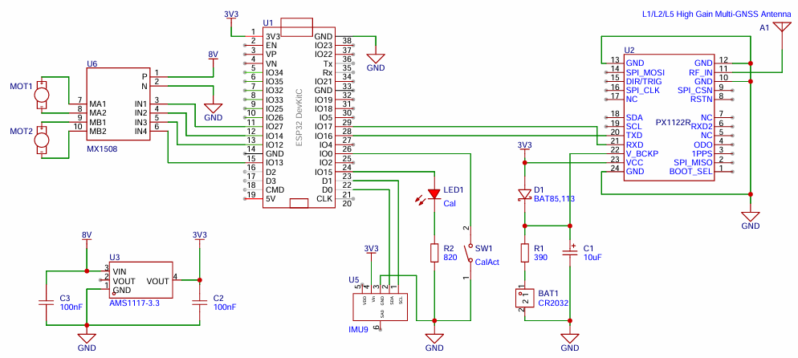
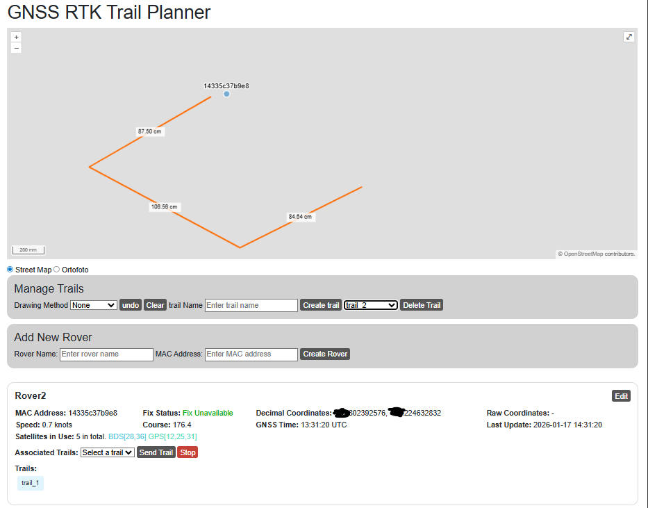

# GNSS RTK Planner

This is PoC project implementing E2E RTK solution. Use map to draw path (trail), send it to the connected rover and observe how it follows these coordinates.

It consists of 2 main components:
* RTK Rover - a rover designed to receive trails and send GNSS coordinates.
* RTK Planner - a web service for planning and controlling the RTK Rover position.

## RTK Rover

This is a micropython implementation of GNSS RTK Rover based on ESP32 main board, PX1122R GNSS RTK receiver and electronic compass IMU9.
The rover requires an internet access to get correction data from NTRIP server, receive target trail and send GNSS coordinates 
to RTK Planner server. To get correct rover heading it uses electronic compass. When trail is received the rover execute it only when the GNSS 
quality is a RTK Fix.

### Configuration File

The `config.json` is a mandatory input file with configuration.
Use the `temp_caonfig.json` template, rename it and fill with your data.

NTRIP service depends on your location/country. In my case it was Polish
NTRIP Correction Data Service: https://www.asgeupos.pl/language/en/

The remaining settings concern your WiFi AP credentials and the URL of the network service (RTK Planner).

### Micropython on ESP Board

Read the https://docs.micropython.org/en/latest/esp8266/tutorial/intro.html manual about flashing ESP boards.

Manual for configuring Pycharm IDE for micropython programming is under this link https://mischianti.org/micropython-with-esp8266-and-esp32-flashing-firmware-and-using-pycharm-ide-3/

The file structure on ESP board should look like this:
```
ESP Flash
│   config.json
│   calibration.json
│   main.c
│   boot.c
│   navigation.py
│   rtkplanner.py
│   px1122r.py
│   ntripclient.py
│   logger.py
│   esp32board.py
│
└───microIMU9
│       imu9v6.py
└───microMX1508
│       microMX1508.py
└───microNMEA
       microNMEA.py
```
The `calibration.json` file contains calibration data for IMU9 sensor. This file is automatically generated during calibration procedure. 

### Compass Calibration
Repeat this procedure every time the position of electronic components change, or the RTK Rover environment change. Steps:
1. Turn on the rover.
2. Make sure rover is connected to RTK Planner.
3. Press the `SW1 CalAct` button for 2s.
4. The procedure by default will take 2 minutes. During this period, smoothly rotate the RTK Rover in every possible direction, drawing shapes in the air similar to number 8.

### Schematic



## RTK Planner
This is a web service used to manage RTK Rovers and trails. A trail is a collection of GNSS points, created by drawing desired path on the map. The RTK Planner provides following functionalities:
* manage rover (add, update, delete)
* manage trail (add, delete)
* send trail to rover
* stop trail execution on rover
* monitor rover position on map
* control one or more rovers


