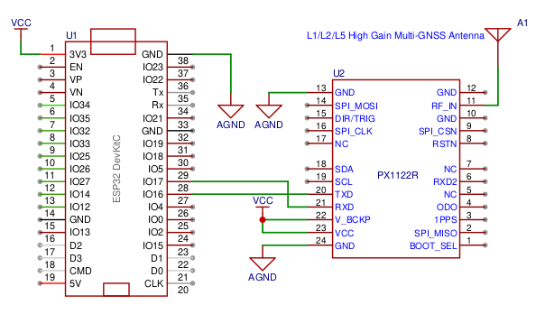

# RTK Planner

This is PoC project implementing E2E RTK solution.

It consists of 2 main components:
* GNSS RTK Rover.
* Web service (RTK Planner) for planning and controling the Rover position.

## GNSS RTK Rover

This is a micropython implementation of GNSS RTK Rover based on ESP32 main board and PX1122R GNSS RTK receiver.
Rover requires an internet access to get correction data from NTRIP server and to send GNSS coordinates 
to server.

### Configuration File

The `config.json` is a mandatory input file with configurations.
Use the `temp_caonfig.json` template, rename it and fill it with your data.

NTRIP service depends on your location/country. In my case it was Polish
NTRIP Correction Data Service: https://www.asgeupos.pl/language/en/

The remaining settings concern your WiFi AP credentials and the URL of the network service (RTK Planner).

### Micropython on ESP Board

Read the https://docs.micropython.org/en/latest/esp8266/tutorial/intro.html manual about flashing ESP boards.

Manual for configuring Pycharm IDE for micropython programming is under this link https://mischianti.org/micropython-with-esp8266-and-esp32-flashing-firmware-and-using-pycharm-ide-3/

The file structure on ESP board should look like this:
```
ESP Flash
│   main.c
│   config.json
│
└───microNMEA
       microNMEA.py
```

### Schematic



## Web Service

TODO
